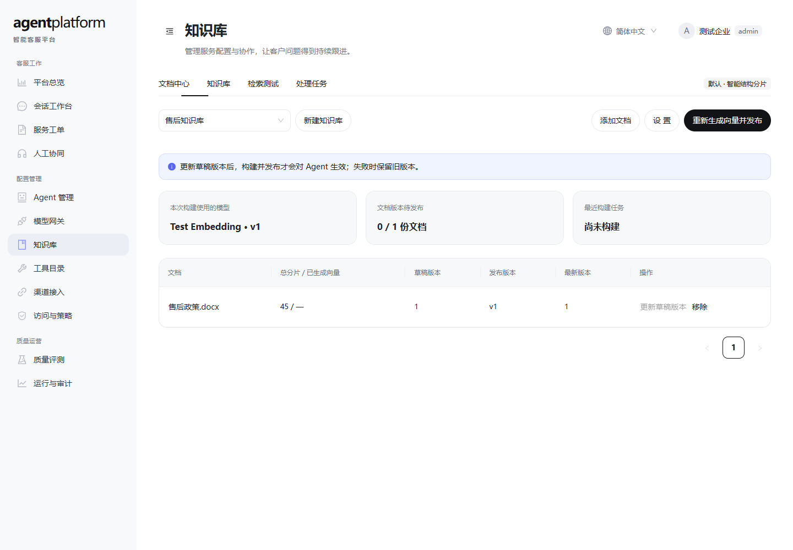
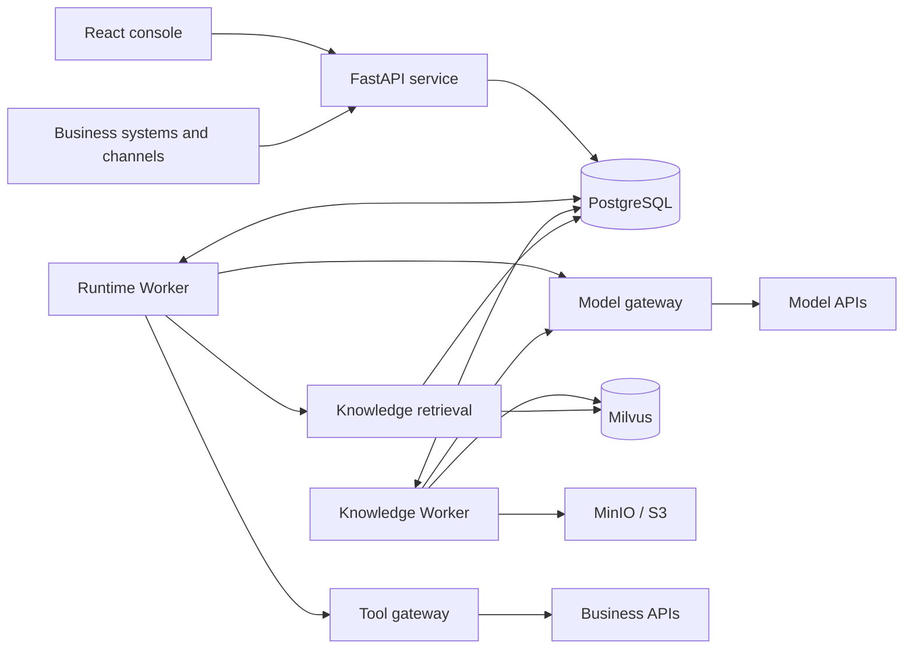

# NexusDesk

[简体中文](README.md) · English

[](https://github.com/GroundedCore/nexusdesk/actions/workflows/ci.yml)

**An AI agent-powered platform for intelligent customer service and service collaboration.**

NexusDesk connects knowledge retrieval, business tool invocation, human collaboration, and ticket handling into a single customer service flow, helping teams build agents that can answer questions, execute tasks, and follow up on outcomes.

Built with Python, LangGraph, and React. It supports a two-container quickstart experience as well as production deployments that use dedicated workers and external middleware.

[Quickstart](#quickstart) · [Production deployment](#production-deployment) · [Documentation](#documentation) · [Contributing](#contributing)

> The project is under continuous development and already has a working core customer service flow. Current capabilities and planned work are described separately; the scope of deployment validation is recorded in the [validation record](deploy/validation-20260923.md).

## Product preview



Knowledge workspace: manage documents, chunks, indexes, and published versions. The screenshot uses test data.

## Core capabilities

| Capability | What you can do |
| --- | --- |
| Agent configuration and execution | Configure and publish agents; run reasoning and tool calls through an asynchronous LangGraph ReAct loop |
| Knowledge base and retrieval | Ingest documents, configure chunking, preview content, build vector indexes, and test retrieval quality |
| Unified model integration | Manage connections, catalogs, and versioned profiles for Chat, Embedding, Rerank, OCR, and speech models |
| Business tool integration | Connect business APIs and manage invocation credentials, parameters, and execution permissions |
| Human collaboration and tickets | Support conversation takeover, ticket drafting, and confirmation so issues that need follow-up enter the service flow |
| Channels and application access | Expose customer service capabilities to business systems through channel interfaces and application APIs |
| Observability and evaluation | Review execution records, tool calls, and evaluation results to troubleshoot issues and improve continuously |

Typical flow: a user asks a question → the agent retrieves knowledge or calls a business tool → the result is returned → a human handoff or a ticket confirmation happens as needed.

## Quickstart

Requires Docker and Docker Compose v2. Run these commands from the project root. On Docker Desktop, select Linux containers; the first build needs network access.

```bash
# Linux / macOS
sh nexusdesk quickstart
```

```powershell
# Windows PowerShell
.\nexusdesk.ps1 quickstart
```

Open **https://localhost:8080**, then open `sample-support` in the conversation workbench:

- Enter `发货需要多久？` ("How long does shipping take?") to try knowledge Q&A.
- Enter `帮我创建工单` ("Help me create a ticket") to try the draft, confirm, and create flow.

The demo ships its own self-signed certificate, so reaching it over a LAN IP or an internal hostname is still a secure context and the browser secure-context restrictions (`crypto.randomUUID`, clipboard access) stay out of the way. The first visit warns about the untrusted certificate; importing `/data/tls/ca.crt` from the container removes that. When using a LAN address, set `NEXUSDESK_TLS_HOSTS` so the certificate covers it — see the [deployment guide](deploy/README.md).

Nine industry case sets are also loaded: 9 knowledge bases, 18 agent drafts, and 36 documents. Every resource name carries the `[案例]` prefix, the agent list can be filtered with "examples only", and the case agents are pre-bound to the demo Chat profile so they are ready to chat.

Only two containers (App + PostgreSQL) are started, and no model key is required. The preset scenario uses a mock model and the page shows a demo badge; it is for local evaluation only and does not represent real model answer quality.

> **Keep the two demo inputs above in Chinese.** The mock model triggers on hard-coded Chinese phrases (`工单` selects the ticket tool), and the seeded demo documents are Chinese, so translated inputs will not exercise the same paths.

## Production deployment

Copy the configuration template, fill in the role tokens and the external PostgreSQL connection, configure Milvus / S3 as needed, then start:

```bash
# Linux / macOS (copy the template only on the first deployment)
cp deploy/production/.env.example deploy/production/.env
# Edit deploy/production/.env and replace the placeholders
sh nexusdesk deploy
```

```powershell
# Windows PowerShell (copy the template only on the first deployment)
Copy-Item deploy/production/.env.example deploy/production/.env
# Edit deploy/production/.env and replace the placeholders
.\nexusdesk.ps1 deploy
```

The default entry point is **http://localhost:8080**; enter the configured role token under "Access and Policy". The platform can start without a default model: configure and publish a Chat profile in the model gateway, bind it to an agent, and conversations can begin.

The production topology separates Web, API, Runtime Worker, and Knowledge Worker, and runs migrations as a dedicated one-shot task. Before reusing an existing database, restore the original credential master key; see the [deployment manual](deploy/README.md) for HTTPS, backup, upgrade, and external access configuration.

## Architecture overview



This is a modular monolith: the API and the workers share one backend codebase and are deployed as separate processes. PostgreSQL stores business data and the task queue; Milvus, S3, and an external parsing service are enabled per feature.

| Layer | Technology |
| --- | --- |
| Frontend | TypeScript, React, Ant Design, Vite |
| Backend and execution | Python, FastAPI, LangGraph |
| Data and migrations | PostgreSQL, SQLAlchemy, Alembic |
| Knowledge storage | Milvus, MinIO / S3 (configured as needed) |
| Deployment | Docker Compose, Nginx |

Detailed dependencies are listed in the [middleware guide](docs/middleware.md). Ordinary customer service scenarios call business APIs as tools; when using external model services, the application server needs no GPU.

## Documentation

The documents listed below are currently written in Simplified Chinese.

| I want to... | Document |
| --- | --- |
| Use the customer service workbench | [Platform guide](docs/platform.md) |
| Deploy, upgrade, or migrate data | [Docker deployment manual](deploy/README.md) |
| Understand middleware and configuration | [Middleware guide](docs/middleware.md) |
| Start a local development environment | [Local development](docs/local-development.md) |
| Understand the architecture and extension modules | [Module architecture](docs/architecture.md) · [Module development guidelines](docs/module-development.md) |
| Understand how agents execute | [Runtime documentation](docs/runtime.md) |
| Configure the knowledge base | [Knowledge workspace](docs/knowledge-workspace.md) |
| Integrate model services | [Model gateway protocol](backend/src/agent_platform/modules/model_gateway/PROTOCOL.md) |
| Integrate business applications | [API reference](docs/api.md) · [Open platform](docs/open-platform.md) |
| Manage database changes | [Migration guide](docs/database-migrations.md) |
| See what changed in a release | [Changelog](CHANGELOG.en.md) |

## Roadmap

The following are ongoing improvement directions. They do not represent delivered capabilities or release commitments:

- Expand business tool and channel integrations to cover real customer service scenarios.
- Continuously validate knowledge retrieval quality, large-document handling, and task recovery.
- Improve identity integration, runtime monitoring, backup and recovery, and capacity validation.
- Improve developer documentation, automated validation, and the deployment experience.

Each module's design and implementation scope is described in the [module planning index](docs/architecture.md).

## Contributing

Contributions are welcome through issue reports, documentation improvements, test cases, and code.

1. When reporting an issue, describe the usage scenario, reproduction steps, deployment mode, and sanitized logs.
2. Before developing, read [Local development](docs/local-development.md) and [Module development guidelines](docs/module-development.md).
3. When submitting a change, describe the problem it solves, the scope of impact, and the validation results; update documentation and migrations when interfaces or data structures change.

Do not include API keys, access tokens, or customer privacy data in issue reports, screenshots, or code.

## License

This project is licensed under the [Apache License 2.0](LICENSE).
