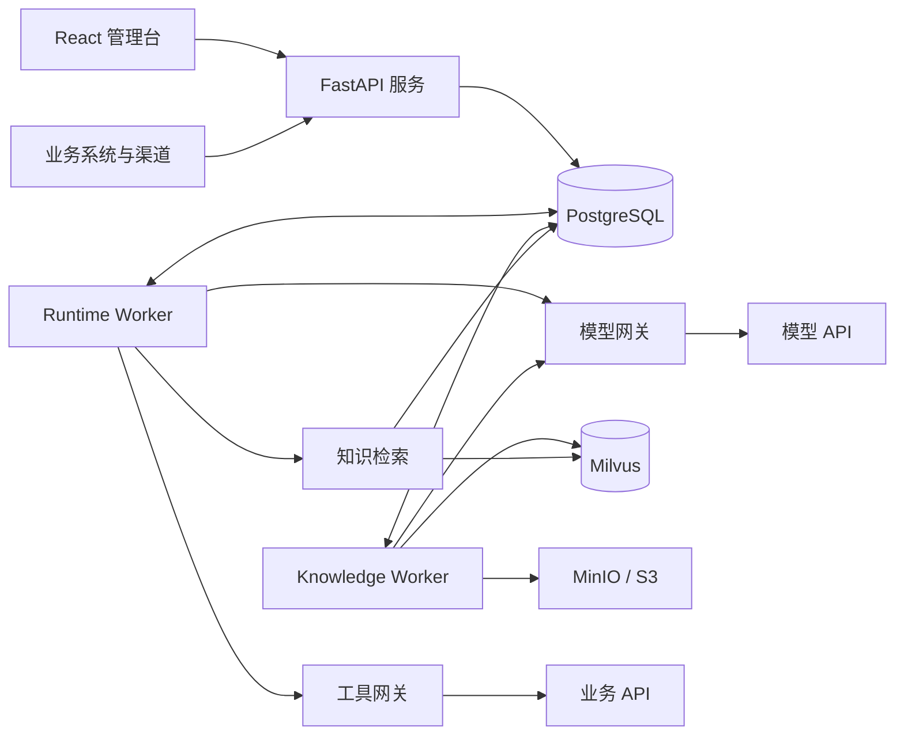

# NexusDesk

简体中文 · [English](README.en.md)

**基于 AI Agent 的智能客服与服务协同平台。**

NexusDesk 将知识检索、业务工具调用、人工协同与工单处理连接到统一的客服流程中，帮助团队构建能够回答问题、执行任务并跟进处理结果的智能客服。

基于 Python、LangGraph 与 React 构建，支持两容器快速体验，以及使用独立 Worker 和外部中间件的生产部署。

[快速体验](#快速体验) · [生产部署](#生产部署) · [文档导航](#文档导航) · [参与贡献](#参与贡献)

> 项目处于持续开发阶段，已具备可运行的客服核心流程。功能现状与规划分别说明，部署验证范围见 [验证记录](deploy/validation-20260923.md)。

## 产品预览


知识库工作台：管理文档、分片、索引和发布版本。截图使用测试数据。

## 核心能力

| 能力 | 可以做什么 |
| --- | --- |
| Agent 配置与执行 | 配置并发布 Agent，通过异步 LangGraph ReAct 循环执行推理与工具调用 |
| 知识库与检索 | 接入文档、配置分片、预览内容、构建向量索引并测试检索效果 |
| 统一模型接入 | 管理 Chat、Embedding、Rerank、OCR 和语音模型的连接、目录及版本方案 |
| 业务工具集成 | 接入业务 API，管理调用凭据、参数与执行权限 |
| 人工协同与工单 | 支持会话接管、工单拟定及确认，让需要后续处理的问题进入服务流程 |
| 渠道与应用接入 | 通过渠道接口和应用 API 将客服能力接入业务系统 |
| 运行观测与评估 | 查看执行记录、工具调用和评估结果，辅助排查问题与持续改进 |

典型流程：用户发起咨询 → Agent 检索知识或调用业务工具 → 返回结果 → 按需转人工或确认创建工单。

## 快速体验

准备 Docker 与 Docker Compose v2，在项目根目录执行。Docker Desktop 请选择 Linux 容器模式；首次构建需要联网。

```bash
# Linux / macOS
sh nexusdesk quickstart
```

```powershell
# Windows PowerShell
.\nexusdesk.ps1 quickstart
```

打开 **http://localhost:8080**，进入会话工作台的 `sample-support`：

- 输入“发货需要多久？”体验知识问答。
- 输入“帮我创建工单”体验拟定、确认与创建流程。

仅启动 App + PostgreSQL 两个容器，无需模型密钥。预置场景使用模拟模型，页面显示演示标识，仅供本机体验，不代表真实模型回答质量。

## 生产部署

复制配置模板，填写角色 Token 和外部 PostgreSQL，按需配置 Milvus / S3，然后启动：

```bash
# Linux / macOS（仅首次部署复制模板）
cp deploy/production/.env.example deploy/production/.env
# 编辑 deploy/production/.env，替换占位符
sh nexusdesk deploy
```

```powershell
# Windows PowerShell（仅首次部署复制模板）
Copy-Item deploy/production/.env.example deploy/production/.env
# 编辑 deploy/production/.env，替换占位符
.\nexusdesk.ps1 deploy
```

默认访问 **http://localhost:8080**，在“访问与策略”填写配置的角色 Token。平台无需默认模型即可启动；在模型网关配置并发布 Chat 方案，绑定到 Agent 后开始对话。

生产拓扑拆分 Web、API、Runtime Worker 与 Knowledge Worker，并执行独立迁移任务。复用已有数据库前需恢复原始凭据主密钥；HTTPS、备份、升级与外部访问配置见 [部署手册](deploy/README.md)。

## 架构概览



采用模块化单体架构，API 与 Worker 共用后端代码，按进程独立部署。PostgreSQL 保存业务数据和任务队列；Milvus、S3 与外部解析服务按功能启用。

| 层次 | 技术 |
| --- | --- |
| 前端 | TypeScript、React、Ant Design、Vite |
| 后端与执行 | Python、FastAPI、LangGraph |
| 数据与迁移 | PostgreSQL、SQLAlchemy、Alembic |
| 知识存储 | Milvus、MinIO / S3（按需配置） |
| 部署 | Docker Compose、Nginx |

详细依赖见 [中间件说明](docs/middleware.md)。普通客服业务通过 API 工具调用；使用外部模型服务时，应用服务器无需 GPU。

## 文档导航

| 我想要…… | 文档 |
| --- | --- |
| 使用客服工作台 | [平台使用说明](docs/platform.md) |
| 部署、升级或迁移数据 | [Docker 部署手册](deploy/README.md) |
| 了解中间件与配置 | [中间件说明](docs/middleware.md) |
| 启动本地开发环境 | [本地开发](docs/local-development.md) |
| 了解架构和扩展模块 | [模块架构](docs/architecture.md) · [模块开发规范](docs/module-development.md) |
| 理解 Agent 执行机制 | [Runtime 文档](docs/runtime.md) |
| 配置知识库 | [知识库工作台](docs/knowledge-workspace.md) |
| 接入模型服务 | [模型网关协议](backend/src/agent_platform/modules/model_gateway/PROTOCOL.md) |
| 接入业务应用 | [API 说明](docs/api.md) · [开放平台](docs/open-platform.md) |
| 管理数据库变更 | [迁移指南](docs/database-migrations.md) |

## 后续方向

以下为持续完善方向，不代表已交付能力或发布承诺：

- 扩展业务工具与渠道适配，完善实际客服场景。
- 持续验证知识检索质量、大文档处理与任务恢复能力。
- 完善身份接入、运行监控、备份恢复与容量验证。
- 改进开发文档、自动化验证及部署体验。

各模块的设计与实施范围见 [模块规划索引](docs/architecture.md)。

## 参与贡献

欢迎通过问题反馈、文档改进、测试用例与代码贡献参与建设。

1. 提交问题时说明使用场景、复现步骤、部署方式与脱敏日志。
2. 开发前阅读 [本地开发](docs/local-development.md) 与 [模块开发规范](docs/module-development.md)。
3. 提交变更时说明解决的问题、影响范围与验证结果；接口或数据结构变化同步更新文档和迁移。

请勿在问题报告、截图或代码中包含 API Key、访问令牌及客户隐私数据。

## 许可证

本项目采用 [Apache License 2.0](LICENSE) 许可。
