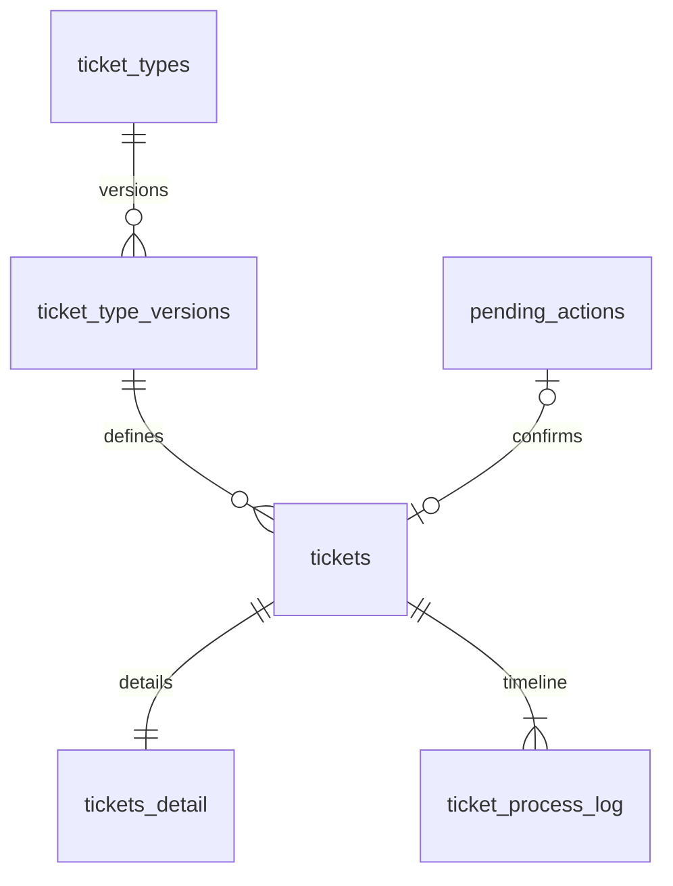

# 通用智能客服工单设计 v1

状态：业务方案；0008_ticketing 已准备直接切换迁移（表、回填、约束及旧列删除），现有工单读写和状态页面已接入新结构；类型设计器、动态字段校验与管理页面尚未实现。采用 PostgreSQL：**固定主表＋JSONB 业务详情＋独立处理记录**。保留现有 customer_service 归属，不新建独立微服务；与[模块规划](README.md)配套阅读。

## 1. 范围与关系

首版支持工单类型、预置字段选择、确认创建、分配、处理、待客户补充、解决和关闭。工单不是问答或人工接管的必经步骤。

三张业务表：tickets、tickets_detail、ticket_process_log。两张配置表：ticket_types、ticket_type_versions。沿用 pending_actions 的提议与确认、staff_accounts 的员工主体、handoffs 的人工交接和 audit_records 的操作审计。



一张工单固定使用一个类型版本。类型配置发布不修改历史工单，不要求给每种类型建表。预置字段定义先使用代码注册表，类型版本保存所选字段的完整定义快照，避免注册表升级改变历史含义。

## 2. 主表 tickets

下表为目标结构，沿用现有 UUID 主键；默认非空，可空列另行注明。主表服务于列表、分配、权限过滤及统计。

| 字段 | PostgreSQL 类型 | 约束及用途 |
|---|---|---|
| id | UUID | 主键 |
| tenant_id | TEXT | 租户；与 id 另建联合唯一约束供租户外键引用 |
| ticket_no | VARCHAR(50) | 租户内唯一的展示编号；系统生成，冲突重试，不使用 MAX+1 |
| type_id | UUID | 工单类型 |
| type_version | INTEGER | 绑定已发布类型版本 |
| conversation_id | UUID | 可空，保留现有字段名作为来源会话 |
| source_run_id | UUID | 可空，来源 Agent Run |
| action_id | UUID | 可空且唯一，关联创建提议，沿用原幂等保障 |
| customer_id | VARCHAR(100) | 可空，可信渠道映射的客户标识，不接受模型自报身份 |
| channel | VARCHAR(30) | 可空，来源渠道 |
| title | VARCHAR(200) | 标题，去首尾空白后不能为空 |
| status | VARCHAR(30) | 默认 open；CHECK 限定五种状态 |
| priority | SMALLINT | 默认 2；CHECK 1～4，对应低、普通、高、紧急 |
| assignee_id | UUID | 可空，当前处理员工；必须属于同租户且具备处理资格 |
| created_by | TEXT | 服务端确定的主体标识；迁移未知值明确记为 legacy |
| due_at | TIMESTAMPTZ | 可空，内部处理截止时间，首版不是完整 SLA 引擎 |
| resolved_at | TIMESTAMPTZ | 可空，当前最近解决时间 |
| closed_at | TIMESTAMPTZ | 可空，关闭时间 |
| revision | INTEGER | 默认 1；CHECK >0，整个工单聚合的并发版本 |
| created_at | TIMESTAMPTZ | 默认 now() |
| updated_at | TIMESTAMPTZ | 默认 now()，服务在修改事务中维护 |

约束：UNIQUE(tenant_id,ticket_no)；(tenant_id,type_id,type_version) 引用类型版本的对应联合键；负责人使用租户范围关联。关联 pending_actions、员工、会话、Run 时应补齐必要的联合唯一键，或在服务事务中验证可信归属，不能只凭全局 UUID 推断授权。

保留来源会话，但移除当前“删除会话级联删除工单”的关系。首版采用 RESTRICT 保留来源链路；会话归档不物理删除。后续若需物理删除，须先通过明确的脱敏/解除引用流程处理，包括 action_id 到 pending_actions 的间接关联，不能只改一条外键就宣称完成独立保留。

## 3. 详情表 tickets_detail

| 字段 | PostgreSQL 类型 | 约束及用途 |
|---|---|---|
| ticket_id | UUID | 主键，一张工单一条详情 |
| tenant_id | TEXT | 非空；联合外键关联 tickets(tenant_id,id) |
| description | TEXT | 非空，问题描述；首版保持现有 1～8000 字符输入限制 |
| resolution | TEXT | 可空，解决说明，建议最多 8000 字符 |
| custom_fields | JSONB | 非空，默认 '{}'；CHECK jsonb_typeof(custom_fields)='object' |

详情只保存当前事实，不存留言数组、附件二进制或完整聊天历史。详情修改同步增加 tickets.revision、更新 updated_at；只有一个并发版本。

退款申请示例：

```json
{
  "contact_name": "张先生",
  "order_no": "ORDER-001",
  "requested_amount": "199.00",
  "currency_code": "CNY",
  "refund_reason": "商品损坏"
}
```

设备报修示例：

```json
{
  "contact_phone": "13800000000",
  "device_no": "DEVICE-001",
  "device_model": "X100",
  "fault_description": "无法启动"
}
```

金额采用规范化十进制字符串，并在服务端转 Decimal 校验精度、范围，避免浏览器浮点舍入；需要统计时显式转换为 numeric。类型定义声明数值单位，申请金额不等于已经执行退款。

JSONB 的边界：

- 状态、租户、类型、负责人、优先级、时间和版本只使用主表固定列，不允许同名业务键覆盖。
- 按绑定版本的 Schema 校验字段类型、必填、长度、枚举、金额与币种等跨字段条件，拒绝未知键，不信任 Agent 输出。
- 首版只允许扁平对象和有限字段类型：短文本、长文本、整数、十进制、布尔、日期、带时区日期时间、单选枚举；不开放任意嵌套对象或脚本。
- 建议首版限制每类型 50 个业务字段、编码后的 custom_fields 不超过 32 KiB；这是初始产品上限，后续依据负载调整。
- 缺失可选字段不写键；清空通过显式 unset_fields 删除键，不把空字符串、null 和缺失混为一种状态。
- 新增自定义字段后续可沿用此模型；首版只选择预置字段，不需要动态 DDL。

## 4. 类型配置与版本

### ticket_types

| 字段 | 类型 | 用途 |
|---|---|---|
| id | UUID | 主键 |
| tenant_id | TEXT | 租户 |
| code | VARCHAR(50) | 租户内唯一且稳定 |
| name | VARCHAR(100) | 类型名称 |
| enabled | BOOLEAN | 默认 true；停用阻止新建，不阻止存量处理 |
| draft_definition | JSONB | 草稿字段与表单定义，必须是对象 |
| revision | INTEGER | 草稿并发版本，默认 1 |
| published_version | INTEGER | 可空；未发布类型不能用于新建 |
| created_at / updated_at | TIMESTAMPTZ | 创建与修改时间 |

### ticket_type_versions

| 字段 | 类型 | 用途 |
|---|---|---|
| tenant_id / type_id / version | TEXT / UUID / INTEGER | 联合主键；引用同租户 ticket_types |
| schema_version | INTEGER | 定义格式版本，首版 1 |
| name | VARCHAR(100) | 类型名称快照 |
| definition | JSONB | 完整字段定义及显示规则快照，不只引用可变注册表 |
| created_by | TEXT | 发布主体 |
| created_at | TIMESTAMPTZ | 发布时间 |

definition 示例：

```json
{
  "fields": [
    {"code": "order_no", "type": "text", "label": "订单号", "required": true, "max_length": 100, "visibility": "customer", "editable_by": ["staff", "agent_proposal"], "order": 1},
    {"code": "requested_amount", "type": "decimal", "label": "申请金额", "required": true, "precision": 18, "scale": 2, "minimum": "0.00", "visibility": "internal", "editable_by": ["staff"], "order": 2}
  ]
}
```

定义完整性校验要求金额字段与币种同时配置。示例只展示单字段形状，不是可直接发布的完整退款模板。所有枚举值与字段约束冻结在版本内；Schema 由服务端从受限字段定义生成，不加载任意远程引用。

用户可选择字段、设置必填、显示名称、排序、填写提示和字段可见性。显示权限与写权限分开：前端、详情 API、日志及 Agent 工具都必须按角色过滤，不能仅隐藏控件。Agent 可以拟定的字段由服务端授权，不直接修改已确认事实或内部字段。

发布创建不可变版本并更新 published_version，使用 revision 避免覆盖并发修改。已有工单始终按原版本展示和校验；字段停用不删除历史数据。类型版本更新不自动迁移旧工单；首版不提供历史工单批量升级。提议同样固定类型版本，确认时复核当前启用状态及该版本权限。

## 5. 处理记录 ticket_process_log

| 字段 | PostgreSQL 类型 | 用途 |
|---|---|---|
| id | BIGINT GENERATED ALWAYS AS IDENTITY | 主键、稳定分页游标 |
| tenant_id / ticket_id | TEXT / UUID | 非空；联合外键关联主表 |
| actor_type / actor_id | VARCHAR(20) / TEXT | staff、customer、agent、system；可信主体 |
| action_type | VARCHAR(30) | created、assigned、status_changed、detail_changed、remark、reply、ai_summary、legacy_note |
| visibility | VARCHAR(20) | internal / customer；默认 internal |
| content | TEXT | 可空，说明或正文；建议上限 8000 字符 |
| old_status / new_status | VARCHAR(30) | 可空，状态变化 |
| old_assignee_id / new_assignee_id | UUID | 可空，负责人变化 |
| changed_fields | TEXT[] | 可空，修改的字段编码，不复制全部敏感字段值 |
| source_run_id | UUID | 可空，来源 AI Run |
| created_at | TIMESTAMPTZ | 默认 now() |

普通接口仅追加，不修改历史。状态、分配和详情修改与记录同事务写入。通用 audit_records 记录操作审计，过程表提供业务时间线；不把审计当成客户可见回复。

AI 摘要保存诉求、已核实事实、执行结果、缺失信息和下一步，并引用来源 Run；不保存模型内部推理。复用 handoffs 的交接事实，需要时写入摘要快照，不另建第二套交接状态机。回复记录的保存不代表已送达渠道；出站投递与回执仍由 channel 承担。

## 6. 状态与业务命令

| 当前状态 | 可进入的状态 |
|---|---|
| open | in_progress、closed |
| in_progress | waiting_customer、resolved、closed |
| waiting_customer | in_progress、closed |
| resolved | in_progress、closed |
| closed | 首版不开放重开 |

解决必须有 resolution；关闭必须填写关闭原因并进入过程记录。重新进入处理中清空当前 resolved_at，历史解决记录保留；关闭填写 closed_at。分配负责人不自动改变状态。closed 禁止业务字段及负责人变更，追加说明按独立权限允许，不伪装成重新办理。

沿用 POST /actions/{id}/decision 确认入口。以下为目标契约，不是已实现 API：

- GET /ticket-types；PUT 草稿、POST 发布：由工单业务模块管理配置，不放入平台设置。
- GET /tickets：租户范围列表，固定列筛选，稳定游标。
- GET /tickets/{id}：合并主表、详情及类型定义的授权视图。
- PATCH /tickets/{id}：携带 revision、允许修改的固定字段、set_fields、unset_fields；读取原详情合并后完整校验，不做无条件 JSON 覆盖。
- POST /tickets/{id}/transitions、/assignments：显式业务命令，revision 与幂等请求键。
- GET/POST /tickets/{id}/records：分页读和追加留言；服务生成的状态日志不能由客户端任意伪造。

当前 PATCH 直接使用新表结构，状态变更归统一服务执行；不提供旧数据库写入兼容层。

## 7. 事务、幂等与 AI 协作

确认创建在同一 PostgreSQL 事务内完成：锁定会话和提议 → 复核租户、工单模式、类型启用、原版本字段及确认权限 → 写 tickets → 写 tickets_detail → 追加 created 记录 → 标记提议 confirmed → 写会话与审计 → 提交。

延续已有会话先于动作的锁顺序；不能在持有工单锁时反向取得会话锁。类型发布与工单停用的并发边界需在实施时统一锁序和检查位置，避免检查通过后仍被新建绕过。

- action_id 唯一保障确认重试只创建一次；重复确认先返回既有结果，不重新按最新模板建单。
- pending_actions.payload 增加 type_id、type_version、title、description、custom_fields，固定内容；金额或字段修改重新提议，旧确认不能授权新参数。
- 首版新增信息收集能力但不开放另一路无确认创建 API。未来其他入口须使用租户＋来源＋请求幂等键，同键不同内容冲突；不能以会话 ID 唯一限制创建。
- 更新先以 revision 校验并锁定主表，再更新详情与记录，失败整体回滚。禁止多个写接口绕过聚合版本直接修改 JSONB。
- 工具只返回角色可见且必要的数据；knowledge 引用继续通过原 Run/工具事件追溯，不把全文会话塞进 custom_fields。
- 工单停用遵循 platform_settings 的 draining/disabled 规则，由业务服务在执行时强制检查，配置快照不能绕过实时停用。

## 8. 查询与性能边界

先围绕实际访问模式建立索引，不以工单数量阈值直接承诺分库分表。

- tickets：唯一 (tenant_id,ticket_no)；列表 (tenant_id,status,created_at,id)；我的待办 (tenant_id,assignee_id,status,updated_at,id)。
- tickets_detail：ticket_id 主键；租户联合外键。列表不使用 SELECT * 读取详情，详情单独关联。
- ticket_process_log：(tenant_id,ticket_id,id)，稳定分页。
- 高频 JSONB 字段可建立受控表达式索引，例如 tenant_id 与 custom_fields->>'order_no'；范围比较按字段定义转类型。
- 不默认给所有字段建 GIN 索引；只有实际包含查询和执行计划证明需要时再加。排序字段必须从服务端白名单映射，所有值参数化，不拼接用户 SQL。
- 高频更新字段仍放固定列；限制 JSONB 大小，不累积过程数组。跨类型统计必须明确字段语义和单位，不能仅因键名相同就汇总。

容量、P95、锁等待和索引成本需要真实 PostgreSQL 数据与负载测试，文档不声明已通过生产并发验收。

## 9. 开发阶段直接切换

1. 新增 0008_ticketing：类型与版本、详情、过程表，以及主表新字段和约束。
2. 已有工单回填租户通用类型 v1、编号和详情；旧 note 导入 legacy_note，不伪造历史状态或操作者。
3. 同一迁移删除 tickets.description/note。后端直接写新结构，不保留双写、兼容列、兼容触发器或旧 API 适配层；API 中 description/note 是查询详情及最近备注的业务 DTO 字段。
4. 创建和状态变更同事务写入详情/过程记录；现有提议流程仍创建通用类型，类型选择及 JSONB 字段编辑以后按本方案实施。
5. 会话删除采用 RESTRICT 并检查提议的间接引用链，避免级联删除工单。
6. 升级前停止旧版本进程，迁移成功后启动新后端。空库可完整升级；有新版业务数据时回退由显式保护阻止。

迁移不要求旧代码兼容。已有开发数据只做一次性转存，开发库本次未执行升级。

## 10. 首版与后续边界

首版：三张业务表、两张配置表、预置字段选择、类型版本、JSONB 校验、负责人、五态流转和过程记录。工单权限仍由既有身份与 policy 控制。

后续按真实需求再做：用户自定义字段、多对象业务关联、附件、满意度、完整 SLA、复杂流程、外部工单适配。它们不加入本次核心表，也不扩大平台设置范围。平台设置仍仅保留层级继承、工单模式及停用流程。

迁移交付与执行边界见 [数据库迁移说明](../../../../../docs/database-migrations.md)。第 9 节按开发阶段直接切换，旧列在迁移中删除。
