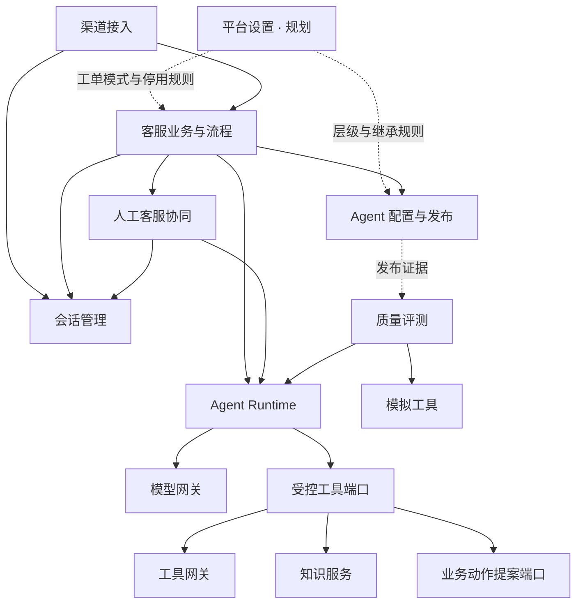

# 模块架构与开发规划索引

平台采用 Python 模块化单体、异步 LangGraph Runtime、PostgreSQL 与 React 管理台。现有 13 个领域模块已有 MVP 实现（含开放平台 open_platform），另有 platform_settings 已准备持久层迁移、业务服务待实现；各 README 分别记录当前实现和后续规划，优先级不代表完成状态。

## 规划索引

| 模块 | 名称 | 文档 |
|---|---|---|
| agent_config | Agent 配置与发布 | [详细规划](../backend/src/agent_platform/modules/agent_config/README.md) |
| agent_runtime | Agent Runtime | [详细规划](../backend/src/agent_platform/modules/agent_runtime/README.md) |
| channel | 渠道接入 | [详细规划](../backend/src/agent_platform/modules/channel/README.md) |
| conversation | 会话管理 | [详细规划](../backend/src/agent_platform/modules/conversation/README.md) |
| customer_service | 客服业务与流程 | [详细规划](../backend/src/agent_platform/modules/customer_service/README.md) |
| human_handoff | 人工客服协同 | [详细规划](../backend/src/agent_platform/modules/human_handoff/README.md) |
| knowledge | 知识服务 | [详细规划](../backend/src/agent_platform/modules/knowledge/README.md) |
| tool_gateway | 工具网关 | [详细规划](../backend/src/agent_platform/modules/tool_gateway/README.md) |
| policy | 策略与权限 | [详细规划](../backend/src/agent_platform/modules/policy/README.md) |
| observability | 运行观测与审计 | [详细规划](../backend/src/agent_platform/modules/observability/README.md) |
| evaluation | 质量评测 | [详细规划](../backend/src/agent_platform/modules/evaluation/README.md) |
| model_gateway | 模型网关 | [详细规划](../backend/src/agent_platform/modules/model_gateway/README.md) |
| open_platform | 开放平台 | [详细说明](open-platform.md) |
| platform_settings | 平台设置（规划中） | [详细规划](../backend/src/agent_platform/modules/platform_settings/README.md) |

每个模块规划包含现状、功能优先级、数据归属、接口契约、依赖边界、设计约束、管理台、阶段与验收。模型网关保留详细配置层级设计。platform_settings 按当前范围仅保留配置层级与继承、工单模式与停用两节，不扩展为其他模块的配置中心。

统一契约、共享事务演进及独立交付规则见[模块独立开发与扩展规范](module-development.md)。

## 协作关系

此图表示职责协作，不能理解为引擎应直接导入所有领域实现。模型及工具经组合入口注入，业务动作提案实现属于 customer_service。policy 提供授权决策，observability 消费各模块事实。评测执行时用模拟工具替换真实执行端口。

平台设置规划仅保留平台／租户／Agent 配置层级与继承规则、工单模式及停用流程。各模块继续拥有自身配置，policy 负责授权，customer_service 负责工单事实及业务执行；不另建通用配置发布中心。

## 状态按领域区分

| 领域 | 当前状态 | 扩展注意事项 |
|---|---|---|
| Run | queued/running/completed/failed/cancelled | 等待输入与检查点恢复为未来设计 |
| 会话 | bot/waiting/human/closed | 人工接管必须约束自动结果提交 |
| 工单 | open/in_progress/resolved/closed | 外部办理的结果未知需独立操作状态 |
| 待确认动作 | pending/confirmed/rejected | 超期目前按 expires_at 判断 |

会话等待人工、业务待确认和 Run 暂停不是同一状态机。当前工单确认在 Run 之外完成，不是 LangGraph 节点级暂停恢复。

## 建设顺序

1. 稳定可信上下文、错误/事件契约及现有会话与运行事务边界。
2. 模型网关在线配置、版本方案及 Agent 绑定已落地首版；继续完善供应商联调、全局额度及工具版本和执行契约。
3. 知识索引、渠道适配、人工坐席、观测查询按各自端口独立扩展。
4. 建立业务操作账本和幂等核查后，建设外部写入及 Runtime 检查点恢复。
5. 完善异步评测、发布门禁、全局额度和运营能力。

先定义端口、数据所有权与假实现，不要求立即拆为微服务。普通 API 调用无需沙箱；未来代码执行应设计独立沙箱边界。

操作说明见[平台使用说明](platform.md)和[Runtime 文档](runtime.md)，已验证范围见[平台验证记录](platform-validation.md)。规划文档不新增可调用接口，也不改变现有数据库。

本轮模块增量、配置和验证状态见 [模块实施说明](modules-delivery.md) 与 [实施记录](implementation-progress.md)；旧版验证记录保留作历史记录。

工单目标结构见 [通用工单设计 v1](../backend/src/agent_platform/modules/customer_service/TICKETING.md)：固定主表、JSONB 业务详情、独立过程记录；直接切换迁移已准备，现有工单读写已接入；类型设计器及自定义字段编辑仍待实现。
